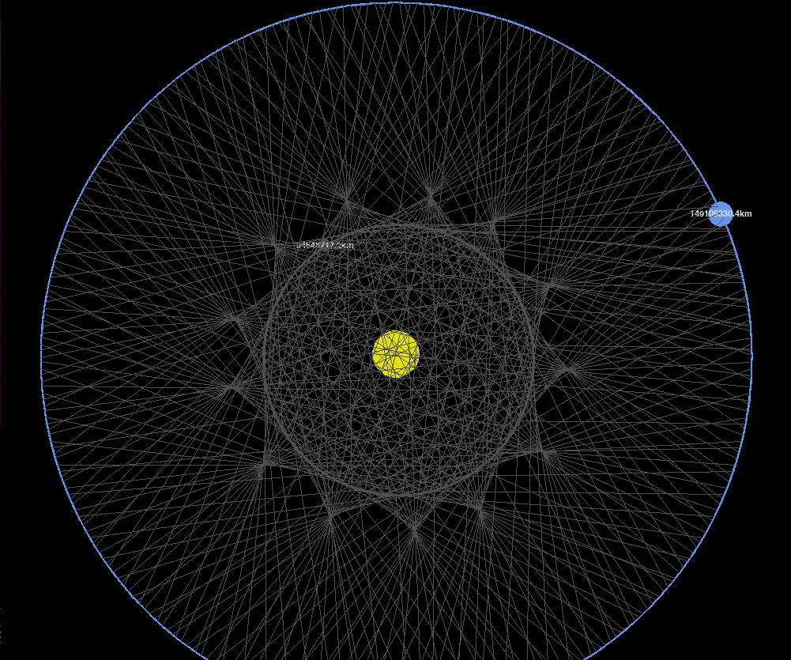
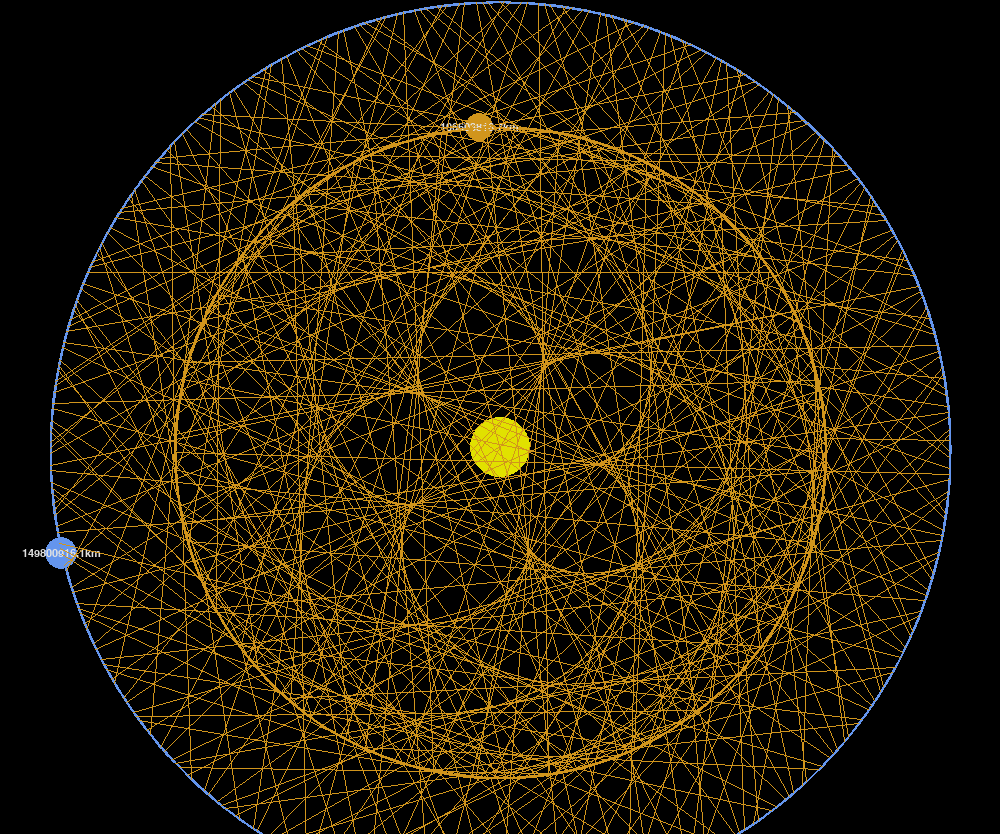
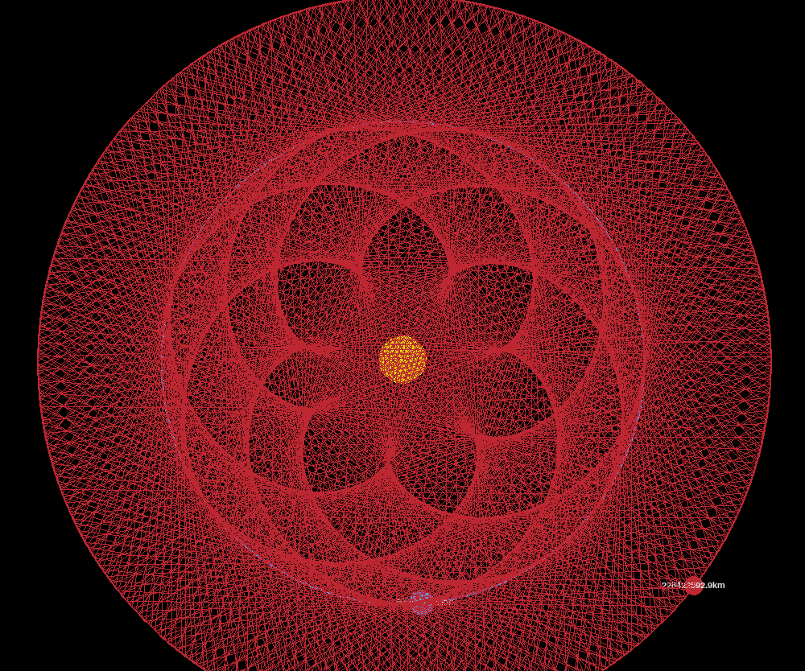
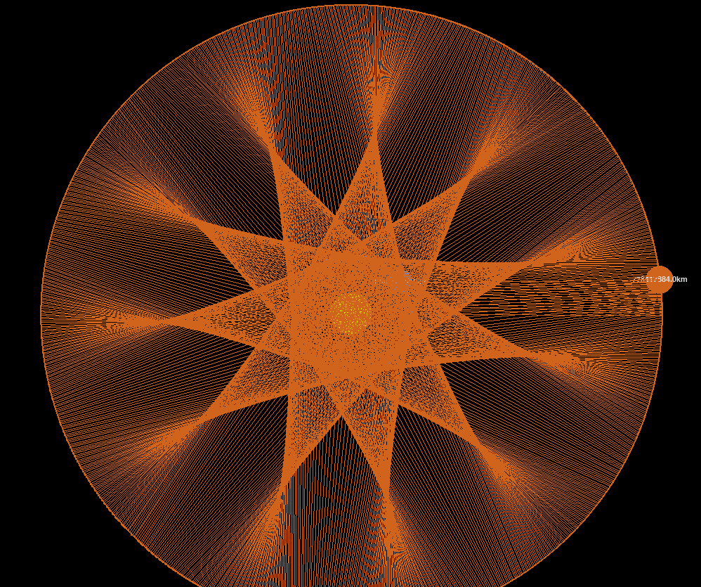
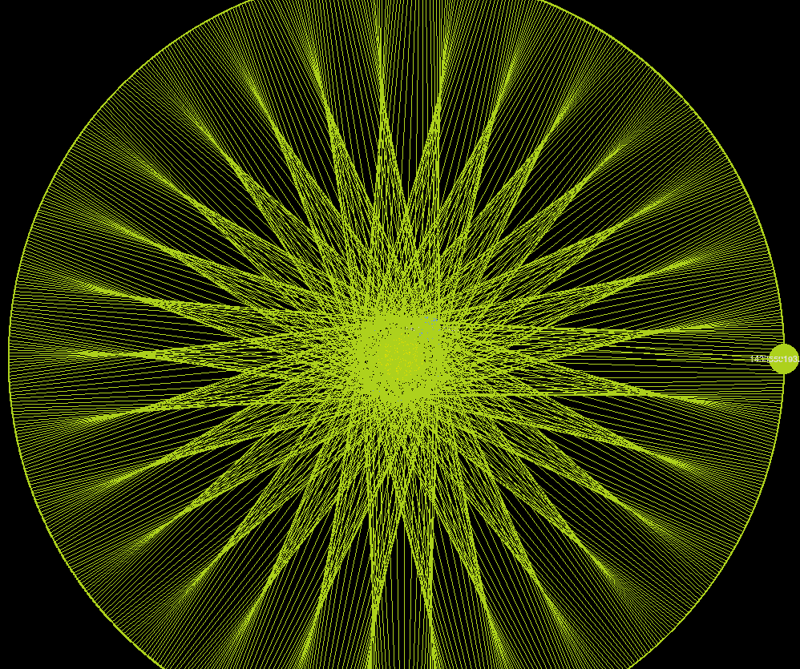
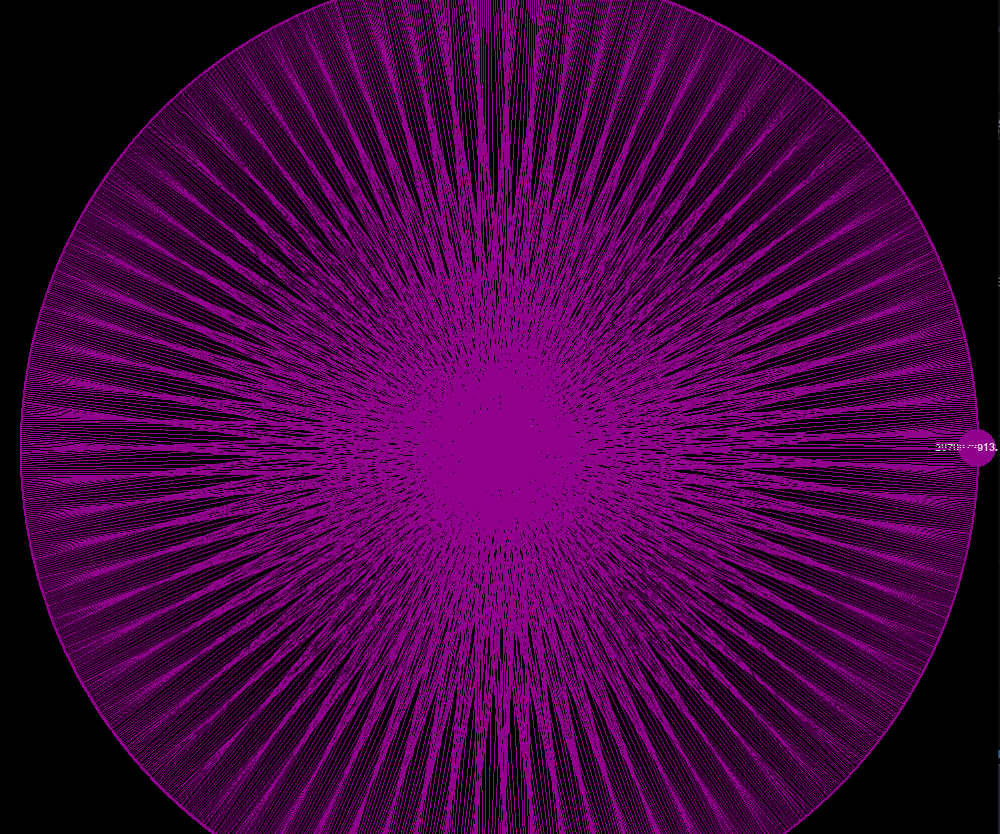

# Planets_Orbit
> The code in this repository reproduces the orbits of the solar system planets, also using the Earth's orbit and any other it performs some interesting pictures, where appears unusual forms, as the following shows:
>
> ## Mercury and Venus
>  
> ## Mars and Jupiter
>  
> ## Saturn and Uranus
>  

## Running the code
> The code runs by making
> ```bash
> python3 main.py
> ```
